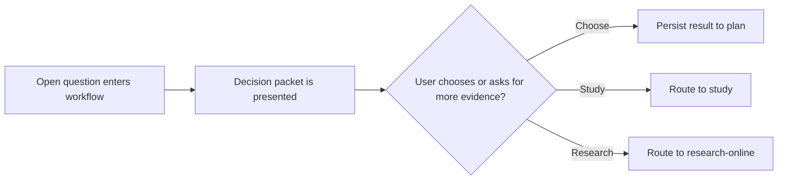
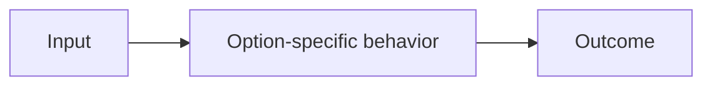

# Decision Presentation Contract

This contract defines two related outputs for `decisions/SKILL.md`:

1. the **detailed markdown decision packet** written to disk as the durable artifact, and
2. the **compact inline decision summary** shown in chat by default.

Use the detailed packet as the source of truth. Present the compact inline summary to the user
unless they explicitly ask for the full raw packet inline or explicitly request the interactive
decision page.

Every user-facing packet from `decisions/SKILL.md` must present exactly one unresolved
decision at a time.

## Depth Mandate (Non-Negotiable)

Compact presentation must never become shallow understanding. The user must be able to answer
all of the following from the packet (and, for blocking decisions, from the inline summary's
**Behavior in plain English** block) without opening unrelated source files:

1. **What happens today** — trigger, step-by-step runtime flow, state read/written, callers.
2. **What an operator observes** when the behavior fires (logs, game/UI state, metrics, failures).
3. **What each option changes** — concrete before → after behavioral diff, not slogans.
4. **One worked scenario** traced through current behavior and each option's outcome.
5. **Edge cases** each option handles or ignores.

**Anti-shallow ban list** (do not present until fixed):

- Option descriptions that are only one sentence with no behavioral consequence.
- Pros/cons that only say "simpler", "more flexible", "larger blast radius" without mechanism.
- Mermaid-only "How It Works" with 3 generic nodes and no prose behavioral diff.
- Context that lists file paths but never explains the runtime path between them.
- Inline summary that is only Field/Value crumbs and a menu table with no behavior narrative.
- Decision statement that names a topic without stating the behavior under choice.

## Mermaid Safety Rules

Codex renders `mermaid` core 11.10.0. The project validator uses
`@mermaid-js/mermaid-cli@11.12.0` (latest CLI; its bundled mermaid core resolves to the latest
11.x, so it validates against the same major version). A single syntax error in any diagram
block produces a "Syntax error in text" render failure. Follow every rule below on every diagram:

1. **Always use triple-backtick fences** — open with ` ```mermaid ` and close with ` ``` `.
   Never use tilde fences (`~~~mermaid`). Codex does not detect tilde-fenced Mermaid blocks.
2. **Quote every node label** — always use `A["label text"]` syntax. Unquoted labels break on
   parentheses, colons, ampersands, angle brackets, and other special characters.
3. **No parentheses inside unquoted labels** — `A[handle (verb)]` is a parse error; write
   `A["handle (verb)"]` instead.
4. **Avoid reserved words as node IDs** — never use `end`, `start`, `style`, `class`,
   `subgraph`, or `graph` as node identifiers.
5. **No markdown syntax inside labels** — bold (`**`), backticks, or angle brackets inside a
   label will cause a parse error.
6. **Skip `subgraph` blocks by default** — they add extra syntax requirements and are
   disproportionately error-prone. Only add one when the diagram is materially clearer with it.
7. **Keep diagrams small** — 3–6 nodes, simple directed edges. Prefer `flowchart LR` for
   horizontal left-to-right flow.

## Interactive Page Path (Opt-In Only)

Only follow this path when the user explicitly asks for the interactive decision page:

1. Normalize the authoritative decision inventory.
2. Materialize the queue into JSON using `references/decision-page-json-contract.md`.
3. Generate the interactive page:
   `npx tsx .agents/skills/decisions/scripts/generate-decision-page.ts --input <definition.json> --output <page.html>`
4. Present the page as a clickable `file://` link using the **absolute path**, followed by a
   brief plain-English list of the decisions the page resolves. Example:

   > **Decision page ready:** [Open decisions](file:///Users/you/project/.tmp/decisions/2026-04-10-subject/index.html)
   >
   > This page resolves:
   > - **Decision title** — one-sentence description of what it decides
   > - **Decision title** — one-sentence description of what it decides

5. After writing a markdown decision packet to a file, validate its Mermaid diagrams:
   `npm run check:mermaid -- --files <decision-packet.md>`

## Default Chat Presentation (Compact Table Summary)

When the user did **not** explicitly request the interactive page and did **not** explicitly ask
for the full raw packet inline, present the current decision in this compact format:

1. short carry-forward status line when relevant, for example `Decision 1 recorded.`
2. short transition line, for example `Now on **Decision 2**.`
3. packet location block:
   - `Packet:`
   - packet path bullet
4. Mermaid validation block:
   - `Mermaid validation:`
   - result bullet
5. `## Active decision` with a two-column table:
   - `Field`
   - `Value`
   - include the most decision-useful rows, usually:
     - `Decision ID`
     - `Question`
     - `Blocker`
     - `Current rule` or `Current state`
     - `Downstream work`
     - `Recommended option`
6. `## Behavior in plain English` (**required** for every decision):
   - 2–5 short paragraphs (or tight bullets) that teach the behavior, not just name it.
   - Must cover: **trigger**, **current step-by-step flow**, **what the user/operator sees**,
     and **what is actually being chosen** (the fork in that flow).
   - Must include **one worked scenario** with concrete identifiers (file, function, creep,
     route, config key, or equivalent) and the outcome under the current rule.
   - This block is the primary comprehension surface. Do not skip it to "keep the summary short."
7. `## Explore before choosing` with a three-column table:
   - `Type`
   - `Token`
   - `What it gives you`
8. `## Choose one` with a side-by-side comparison table:
   - first column: comparison row label
   - remaining columns: choosable options, recommended option first
   - include concrete comparison rows, usually:
     - `Summary`
     - `Exact rule`
     - `Runtime flow change` (before → after in one dense cell)
     - `Code/API change`
     - `Behavioral effect` (observable outcome, not slogan)
     - `Worked scenario outcome` (same scenario as above, per option)
     - `Edge cases handled / ignored`
     - `Data or migration effect`
     - `Main benefit`
     - `Main risk`
     - `Testing / rollout`
     - `Best if...`
9. `## Reply tokens` with a two-column table:
   - short human option label
   - full selector token
10. `## Recommendation` with one or two bullets:
   - recommended token
   - concise why grounded in the behavior narrative above
11. final line: `Reply with one token.`

### Compact Table Rules

- Use options as columns and comparison dimensions as rows.
- Keep the recommended option in the first option column.
- Use short human-readable option labels in the comparison table header.
- Keep full selector tokens out of the wide comparison table; place them in the reply-token table.
- The inline summary is not just a menu. **Behavior in plain English** plus the comparison table
  together must let the user understand the behavior and usually choose without opening the packet.
- Never omit **Behavior in plain English** to save space. Prefer cutting exploratory fluff or
  collapsing low-value comparison rows before cutting behavior narrative.
- Avoid abstract-only cells like `simpler mental model`, `more flexible`, or `larger blast radius`
  unless the same cell also states the exact mechanism or affected surface.
- Prefer a two-part cell shape whenever possible:
  - exact mechanism or affected surface,
  - practical consequence / observable outcome.
- Prefer concrete nouns from the packet over generic summaries:
  - identifier names such as `sourceIdentityKey` or `corpusRootId`,
  - file, module, function, schema, route, or workflow names when known,
  - explicit behavior changes such as `variants stay distinct` or `historical rows need backfill`.
- Keep row labels compact and decision-useful.
- Keep cell text dense. Allow multi-clause cells for `Runtime flow change`, `Behavioral effect`,
  and `Worked scenario outcome`. Shallowness is a defect; width is acceptable.
- If more than four choosable options would make the table unreadable, keep behavior rows fully
  concrete and move secondary rows to the packet — do not hollow out behavior rows.
- If the decision is not code-first, translate `Code/API change` and `Data or migration effect`
  into the closest concrete surfaces, such as config, content model, operator workflow, policy, or
  rollout process.

### Compact Table Example Detail Density

This is the level of specificity the default inline comparison table should aim for:

| Comparison | Keep composite **(recommended)** | Corpus root only |
| --- | --- | --- |
| Exact rule | `directIngestionSourceIdentityKey` stays authoritative; variants remain distinct | `directIngestionCorpusRootId` becomes authoritative; variants collapse under one root |
| Code/API change | keep `IngestionSourceIdentity_computeSourceIdentityKey`; update backend apply semantics | add corpus-root lookup path such as `findActiveBindingByCorpusRootId`; narrow active-binding contract |
| Data or migration effect | no primary-key-family backfill implied | new persisted/indexed corpus-root authority field likely required; historical audit/backfill likely |
| Main risk | backend docs must still explain composite identity clearly | different variation lineages may be conflated if they share one corpus root |

## Visual Formatting Rules

Both the detailed packet and the compact inline summary are for fast user choice in AI coding
tools, so formatting must emphasize contrast and scanning speed.

- Start with one strong top-level heading for the active decision packet.
- Use `##` headings for every major section in the required output order.
- Use `###` headings for option blocks when useful to make options visually distinct.
- Insert `---` horizontal separators between major sections.
- Keep paragraphs short and lists compact.
- Prefer terminal-friendly Markdown structure over dense prose.
- Prefer compact Markdown tables over repeated prose in the default inline summary.
- Whenever any option or path is recommended, mark it with `(recommended)` on both sides.
- Before any bullet list, print a standalone bold list label line, for example
  `**Pros**` or `**Context Items**`.
- Start every bullet item with a bold lead-in that tells the reader what is being presented, for
  example `- **Constraint:** ...` or `- **Risk:** ...`.

## Detailed Packet Output Order

Use this order unless the upstream workflow requires a tighter variant:

1. `Decision Source`
2. `Decision`
3. `Why This Needs A Choice Now`
4. `Context You Need To Decide`
5. `Behavior Being Decided` (**required depth section**)
6. `Worked Scenario` (**required**)
7. `System View`
8. `Representative Code`
9. `STUDY_OPTIONS`
10. `RESEARCH_OPTIONS`
11. `DEEPENING_OPTIONS`
12. `CHOOSEABLE_OPTIONS`
13. `How The Answer Will Be Recorded`
14. `Summary`

## Decision Source

Always state where this decision currently lives, for example:

**Possible Sources**
- **Plan Source:** active `.plans/.../plan-...md` file + section name
- **Study Source:** study path + decision/open-questions section
- **Session Source:** explicit session decision register when no durable artifact exists yet

If the inventory had to be created during normalization, say so directly.

## Decision

Include:

**Required Decision Fields**
- **Decision ID:** a verbose `DECISION_ID`
- **Decision Statement:** a clear one-sentence decision statement
- **Blocker Status:** current blocker status
- **Downstream Work:** the downstream work that is waiting on the answer

## Why This Needs A Choice Now

Explain:

**Required Explanation Points**
- **Blocked Work:** what will stay blocked without the answer
- **Wrong-Choice Risk:** what could be implemented incorrectly if the wrong choice is assumed
- **Affected Areas:** whether the decision affects architecture, UX, rollout, tests,
  documentation, or timing

## Context You Need To Decide

Provide the shortest complete explanation that still lets the user choose confidently:

**Required Context Points**
- **Current State:** current state
- **Constraints:** constraints
- **Existing Assumptions:** assumptions already made by other skills
- **Tradeoffs:** important tradeoffs
- **Known Unknowns:** known unknowns
- **Impacted Surface:** impacted files, services, tasks, or environments

## Behavior Being Decided

This section is mandatory. It is the primary teaching surface for the packet. Do not replace it
with a one-line restatement of the decision title.

Write enough prose that a reader who has not opened the source can reconstruct the behavior.
Target roughly **150–400 words** for Standard/Full decisions (shorter only for truly tiny
non-blocking choices).

**Required subsections / bullets**

- **Trigger:** what condition, event, schedule, user action, or input starts this behavior.
- **Entry points:** concrete functions, routes, jobs, commands, or modules that own the behavior
  (names required when they exist in-repo).
- **Step-by-step current flow:** numbered steps of what happens today from trigger to terminal
  outcome. Include branches that matter to the decision.
- **State read:** memory, DB fields, flags, config, environment, or prior decisions consulted.
- **State written:** fields, files, messages, or side effects produced.
- **Operator / user observation:** what a human notices when this fires (logs, UI, game state,
  metrics, errors, silence).
- **Invariant vs fork:** what stays true no matter which option wins, and where the options diverge
  in the flow (name the fork step).
- **Why shallow labels are insufficient:** one sentence naming the subtlety a title alone misses.

**Quality bar**

- Prefer narrative steps over adjective stacks.
- Name real symbols and paths when known.
- If evidence is incomplete, say what was verified vs inferred.
- Forbidden as the entire section: a single sentence, a bullet list of file paths only, or a
  Mermaid diagram with no prose.

## Worked Scenario

Always include at least one concrete scenario that makes the behavior tangible.

**Required scenario fields**

- **Name:** short label for the scenario.
- **Setup:** concrete actors/identifiers (creep name, user id, route, config value, fixture).
- **Trigger moment:** the exact condition that fires.
- **Current outcome:** what happens today, step by step in 3–8 lines.
- **Why it matters:** cost, risk, or user-visible consequence of the current outcome.
- **Per-option outcomes:** for each `CHOOSEABLE_OPTIONS` entry, 2–5 lines stating how this same
  scenario ends under that option (not a restatement of the option title).

Use real or realistic identifiers. Avoid `foo`/`bar` unless the domain truly has no better names.

## System View

Always include at least one Mermaid diagram. For this skill, prefer horizontal diagrams with
`flowchart LR` because they are easier to scan during active decision-making in AI coding tools. Use
another Mermaid orientation only when it is materially clearer for the specific decision. Follow the
**Mermaid Safety Rules** at the top of this file on every diagram here and in `CHOOSEABLE_OPTIONS`.

Example:


## Representative Code

Always include at least one code snippet or pseudo-diff that grounds the decision in something
concrete. If the decision is not code-first, use config, schema, command, or pseudo-structure snippets.

## CHOOSEABLE_OPTIONS

This section is mandatory and must appear after `STUDY_OPTIONS`, `RESEARCH_OPTIONS`, and
`DEEPENING_OPTIONS`, so the user sees research/deepening paths before commitment paths.

Within this section, list options in this order:

1. recommended option first,
2. remaining viable options after that.

For every option include all of the following:

**Required Option Fields**
- **Selector Token:** use this exact pattern `CHOOSE_DECISION_<DECISION_ID>_<OPTION_NAME>`
- **Description:** 2–4 sentences covering what changes and what stays the same
- **Behavioral Diff:** explicit **Before → After** prose for the runtime flow (not slogans)
- **Observable Outcomes:** what a human notices after this option ships
- **Edge Cases:** at least two edge cases this option handles or deliberately ignores
- **Pros:** explicit pros grounded in the behavioral diff
- **Cons:** explicit cons grounded in the behavioral diff
- **Representative Code:** concrete code, config, or pseudo-diff
- **How It Works:** Mermaid diagram **plus** a short prose caption of the fork
- **Impact:** scope, testing, rollout, docs/guidance, and follow-up workflow implications
- **Worked Scenario Outcome:** how the packet's Worked Scenario ends under this option

Bad selector tokens:

- `CHOOSE_DECISION_D1_OPTION_A`
- `CHOOSE_DECISION_FAST`

Good selector tokens:

- `CHOOSE_DECISION_API_DEPLOYMENT_MODE_KEEP_SINGLE_SERVICE`
- `CHOOSE_DECISION_AUTH_CALLBACK_STRATEGY_MOVE_TO_SUBDOMAIN`

### Option Template
````md
### `(recommended)` `CHOOSE_DECISION_<DECISION_ID>_<OPTION_NAME>` `(recommended)`

**Option Details**
- **Description:** ...

**Behavioral Diff**
- **Before:** ...
- **After:** ...
- **Fork step:** which step in Behavior Being Decided changes

**Observable Outcomes**
- **Operator sees:** ...
- **System emits:** ...

**Edge Cases**
- **Handles:** ...
- **Ignores / accepts:** ...

**Pros**
- **Benefit:** ...

**Cons**
- **Tradeoff:** ...

**Representative Code**
```ts
// concrete snippet or pseudo-diff
```

**How It Works**

Caption: one or two sentences tying the diagram to the behavioral diff.

<!-- Use triple-backtick mermaid fences. Follow Mermaid Safety Rules: quote all labels with
     ["..."], avoid reserved IDs (end/start/class), no markdown inside labels, keep to 3-8 nodes. -->


**Worked Scenario Outcome**
- Under the packet scenario, this option ends with: ...

**Impact**
- **Scope:** ...
- **Testing:** ...
- **Rollout:** ...
- **Docs/Guidance:** ...
- **Downstream Workflows:** ...
````

## STUDY_OPTIONS

Always include at least one study-oriented follow-up when deeper offline analysis would help. These are
not choosable implementation options; they are ways to deepen evidence before deciding.

Recommended pattern:

**Study Paths**
- **(recommended) `RUN_STUDY_<TOPIC>` (recommended):** Produce a focused study via
  `study/SKILL.md`, including what it would answer and which artifacts it would generate.

## RESEARCH_OPTIONS

Always include at least one current-information follow-up when external docs, standards, or product
behavior could change the recommendation.

Recommended pattern:

**Research Paths**
- **(recommended) `RUN_RESEARCH_<TOPIC>` (recommended):** Use `research-online/SKILL.md` to check
  current docs, release notes, standards, or ecosystem practice.

## DEEPENING_OPTIONS

Always include at least one option that improves the user's understanding without immediately choosing
or launching external research.

Examples:

**Deepening Paths**
- **(recommended) `EXPLAIN_IMPACT_<TOPIC>` (recommended):** walk through the blast radius of each
  option in more depth
- **`COMPARE_TEST_STRATEGIES_<TOPIC>`:** focus only on validation and regression risk
- **`SHOW_DATA_FLOW_<TOPIC>`:** produce a deeper architecture walk-through

## How The Answer Will Be Recorded

End every packet by saying exactly where the answer will be persisted and what happens next:

**Persistence Details**
- **Plan file section:** section to patch
- **Study handoff note:** note to append
- **Implementation state:** whether implementation becomes unblocked after the answer

## Summary

End every packet with a concise summary that includes:

**Summary Items**
- **Decision:** the decision in one sentence
- **Recommendation:** the recommended direction
- **Exploration Paths:** the exploration paths available before choosing
- **Implementation Choices:** the implementation choice paths available
- **Blocking State:** what remains blocked or unblocked after the answer
- **Next Step:** what the next workflow step will be
